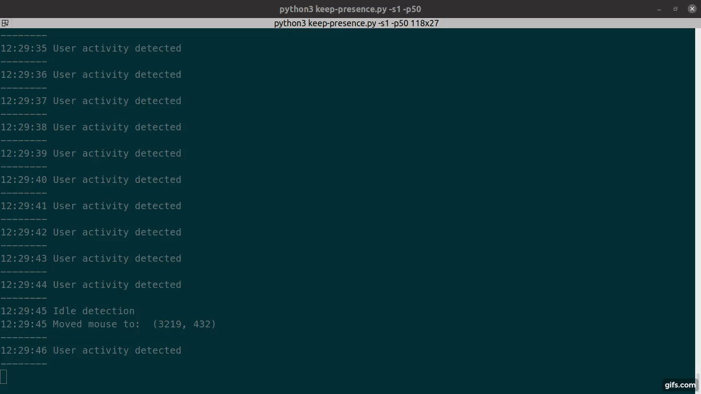

# Keep Presence (fork)

This program moves the mouse or press a key when it detects that you are away.
It won't do anything if you are using your computer. Useful to trick your
machine to think you are still working with it. 

#### Additional functionality introduced by this forked version

Allows keep-presence to be enabled/disabled via the presence of a file located
at `~/.keep-presence-disabled`. If this file exists then keep-presence will not
attempt to trick the machine that it's being used.

I am using this additional functionality alongside i3blocks, whereby I have a
clickable blocklet that enables/disables keep-presence by creating/deleting the
`~/.keep-presence-disabled` file.

I have also introduced an additional command line argument that controls whether
keep-presence is disabled at startup.


## Demo

[](https://github.com/carrot69/keep-presence)

##### Run

```
keep-presence
```

If you don't have the `snap` command available, you might be able to find
instructions for your distro [here](https://docs.snapcraft.io/core/install).

## Manual installation

The script requires `pynput`. To avoid issues, install it in a virtual
environment; for example:

```sh
git clone https://github.com/Peptis/keep-presence.git
cd keep-presence
python -m venv .
bin/pip3 install pynput
bin/python3 src/keep-presence.py
```

## Optional arguments

```
-h, --help                        show this help message and exit
            
-s SECONDS, --seconds SECONDS     Define in seconds how long to wait after a user is
                                  considered idle. Default 300.

-p PIXELS, --pixels PIXELS        Set how many pixels the mouse should move. Default 1.

-c, --circular                    Move mouse in a circle. Default move diagonally.

-m MODE, --mode MODE              Available options: keyboard, mouse, both; default is mouse. 
                                  This is the action that will be executed when the user is idle. 
                                  If keyboard is selected, the program will press the shift key. 
                                  If mouse is selected, the program will move the mouse. 
                                  If both is selected, the program will do both actions.

-r RANDOM RANDOM, --random RANDOM RANDOM
                                  Usage: two numbers (ex. -r 3 10). Execute actions based on a 
                                  random interval between start and stop seconds. 
                                  Note: Overwrites the seconds argument.

-d, --disabled                    Disables keep-presence at startup (adds the ~/.keep-presence-disabled
                                  file). This is useful if you are enabling/disabling this program's operation
                                  via another method.                                  
```
